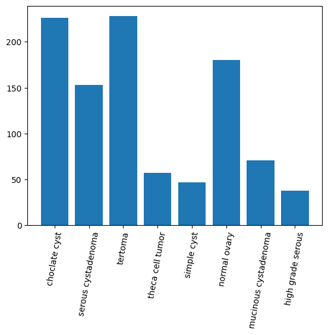
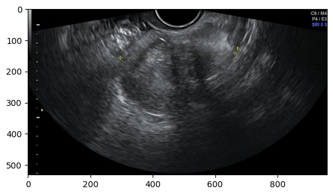
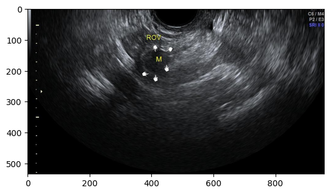
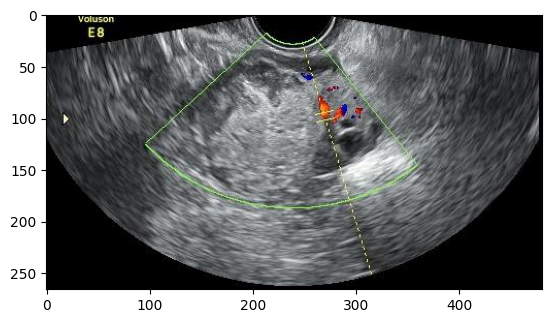

# Ovarian stuff

## Overview

The data used in these project was collected as part of the research done for [A Multi-Modality Ovarian Tumor Ultrasound Image Dataset for Unsupervised Cross-Domain Semantic Segmentation](https://arxiv.org/abs/2207.06799). The papers aim was to create a multi modal model that would work with both 2d ultrasounds and contrast enhanced ultrasonography (CEUS).

I will just be using the `OTU_2d` which just contains the 2D ultrasound images focussing on two tasks specifically:

1. **Segmentation** of the ovarian tumors.
2. **Classification** of the tumor classes.

## Data

The dataset contains 1000 training samples and 469 test samples. Each ultrasound has a corresponding binary mask of the tumour and it's class.

There eight classes:

1. choclate cyst
2. serous cystadenoma
3. tertoma
4. theca cell tumor
5. simple cyst
6. normal ovary
7. mucinous cystadenoma
8. high grade serous

### Potential Issues

The data classes a significantly imbalanced. Particularly for **theca cell tumor**, **simple cyst**, **mucinous cystadenoma**  and **high grade serous** which contains less then 100 samples .

The ultrasounds come in a variety of sizes smallest `302x327` and the largest `1134x784`. This means images will need to be resized or cropped for training.

The images have been annotated with different labels such as `lines`, `hands`, `characters`, and `arrows`. If the model learns to rely on these annotations for its predictions, it may struggle to perform well on images without any annotations, leading to poor generalization.

| lines      | hands/characters | other |
| ----------- | ----------- | ----------- |
|        |        |   |

## Approach

Initial step will to be train a simple u-net to segment the tumors. Following that I will use the pre-trained weights form the U-nets `encoder` and add a liner classification layer to classify 8 classes. Ideally the U-Nets `encoder` will be frozen so that the same model and weights can be used for both classification and segmentation tasks.

## Results

## Improvements

